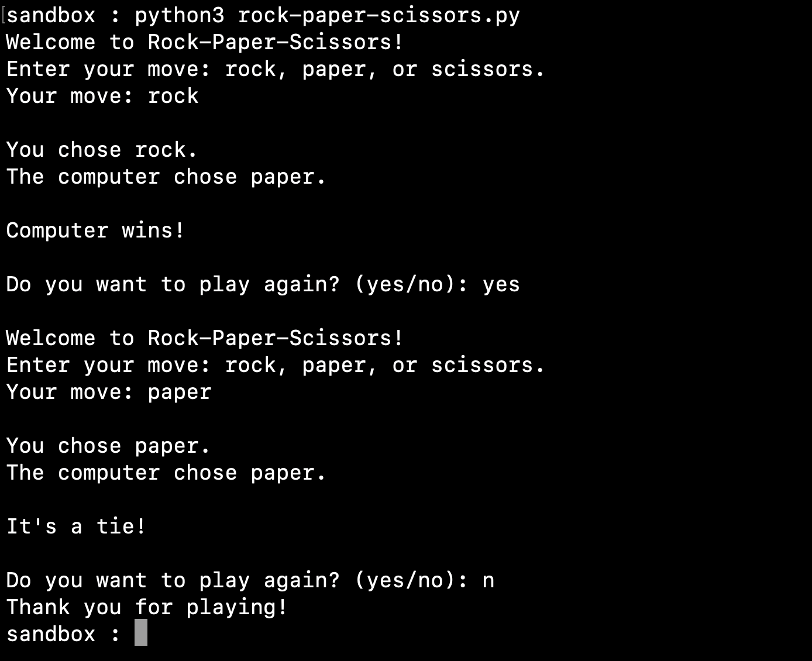

# Rock-Paper-Scissors Game User Manual
## Introduction:
Welcome to the Rock-Paper-Scissors game! This classic game allows you to test your luck and strategy against the computer. The objective is simple: choose rock, paper, or scissors and see if you can beat the computer's move. Follow the steps below to get started:

## Step 1:
Access the Rock-Paper-Scissors game by visiting our website's homepage for [programming-related services](https://domyprograminghomework.io), including options to do my programming homework.

## Step 2:
Once you're on the website, you'll find the Rock-Paper-Scissors game interface. Read the instructions and prepare yourself to challenge the computer.

## Step 3:
To make your move, type in either "rock," "paper," or "scissors" in the input field provided. Be sure to choose wisely!

## Step 4:
After you've made your move, the computer will randomly generate its own move. The results will then be displayed on the screen.

## Step 5:
The outcome of the game will be determined based on the following rules:

Rock beats scissors
Scissors beat paper
Paper beats rock
## Step 6:
If you win, congratulations! If it's a tie or the computer wins, don't worry—there's always another chance to beat it.

## Step 7:
At the end of each game, you'll be given the option to play again. If you're up for another challenge, simply select "yes" and the game will start over.

## Step 8:
If you're finished playing or need to take a break, you can choose "no" when asked to play again.

## Conclusion:
Enjoy the Rock-Paper-Scissors game and have fun testing your skills against the computer! Remember, it's all about making the right moves at the right time. If you need assistance with programming homework or related services, visit our website's homepage to explore options for [doing your programming homework](https://domyprograminghomework.io).

